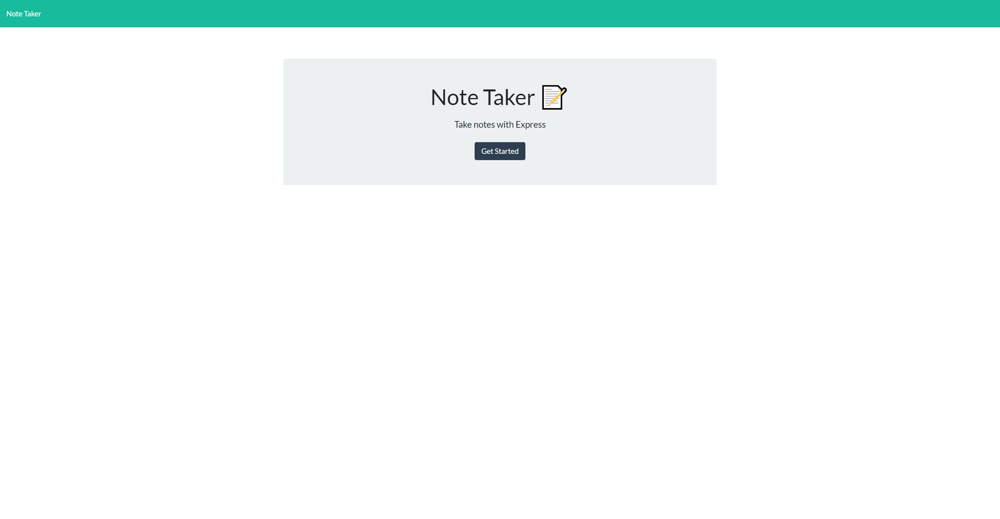
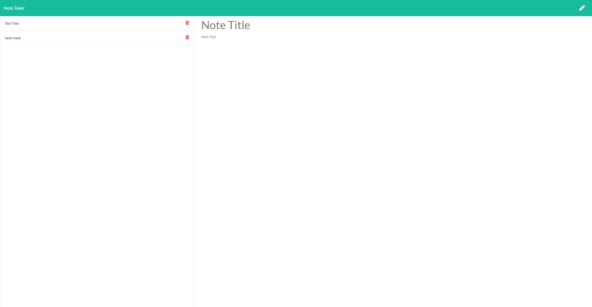

# note-taking-app


## Table of Contents

- [note-taking-app](#note-taking-app)
  - [Table of Contents](#table-of-contents)
  - [Description](#description)
  - [Installation](#installation)
  - [Usage](#usage)
  - [License](#license)
  - [Contributing](#contributing)
  - [Tests](#tests)
  - [deployed url](#deployed-url)
  - [screenshots](#screenshots)

## Description

I've been tasked with making a note taking app that saves to a server data base and is deployed to heroku.
Ive done this by doing;

- building server file
  - building controllers for functions such as delete,
  - building a db to push into for notes,
  - building routes so that what ever is clicked the route works,
  - utils for reading and writing to file.

## Installation

```
git clone git@github.com:Cratesy/note-taking-app.git
cd note-taking-app
npm install
```

## Usage

As a user, i am confronted by the landing page where i can click to start a note which directs you to notes page.
On the notes page i can input a title and a body of text which i can save. On save it will then be displayed in a list on the left.
In this list you can click on it to view/ re edit it or delete it using the trash can icon.

## License

[MIT License](https://opensource.org/licenses/MIT)

## Contributing

[Mike](https://github.com/Cratesy)

## Tests

None were needed

## deployed url

https://aqueous-stream-42133.herokuapp.com/

## screenshots






